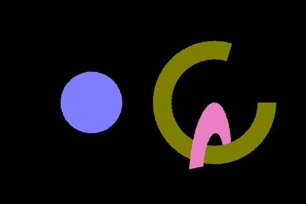
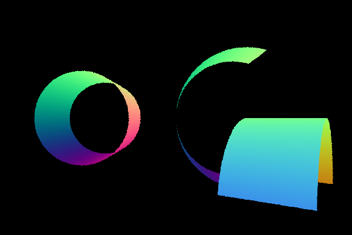
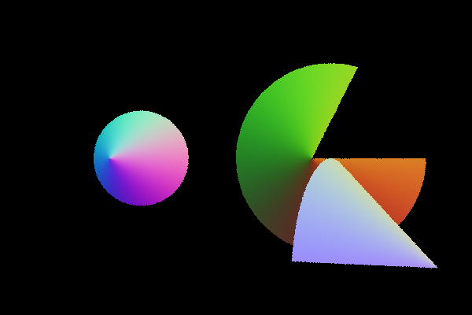
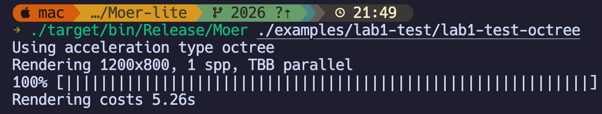
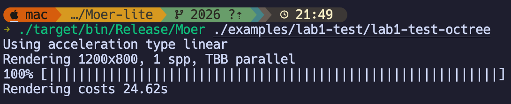
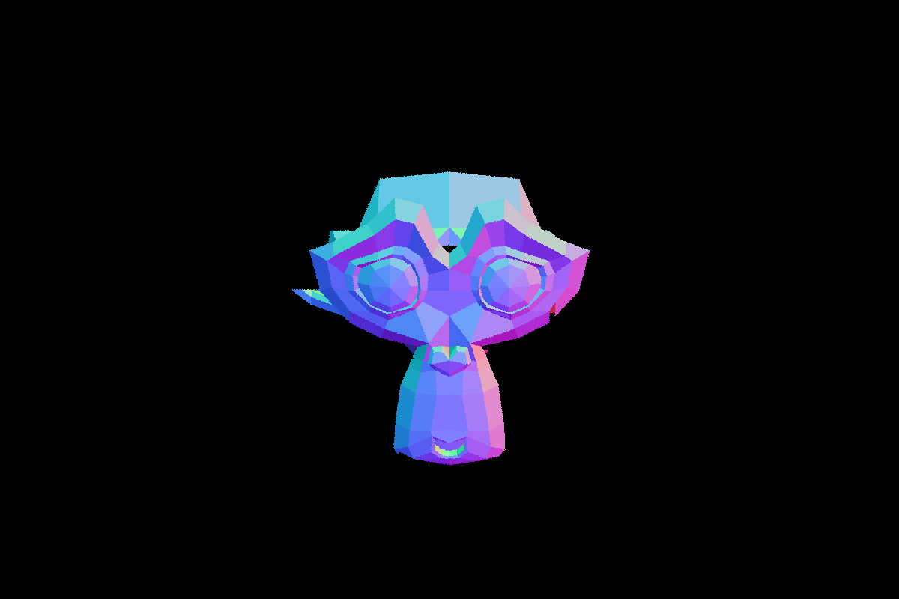
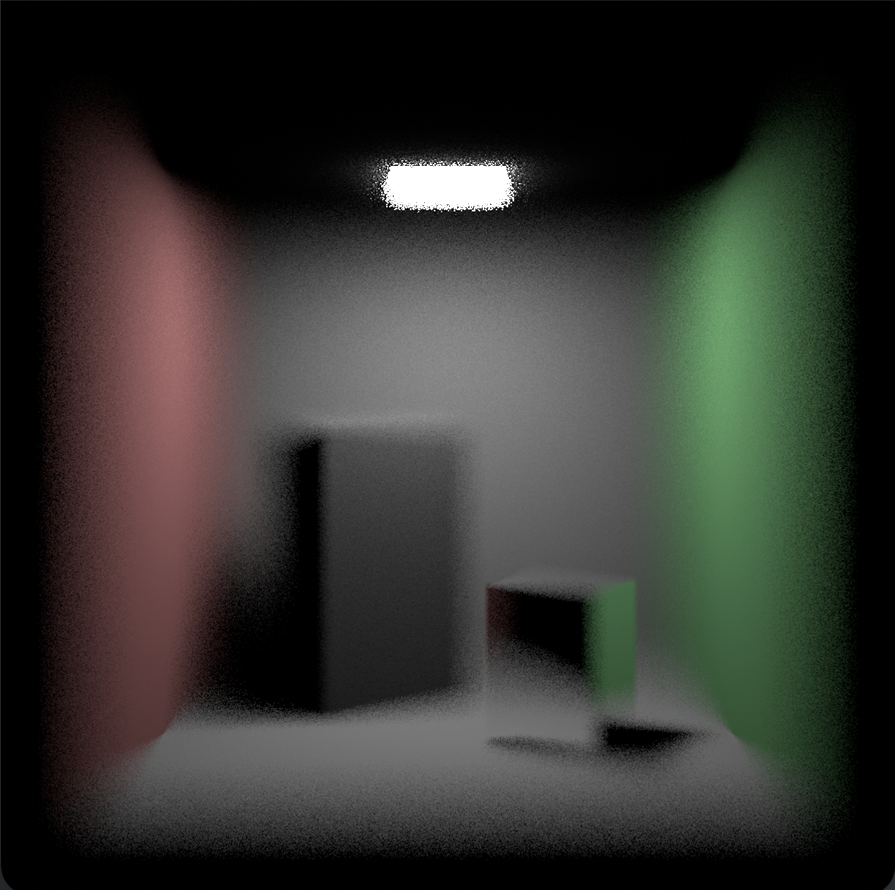
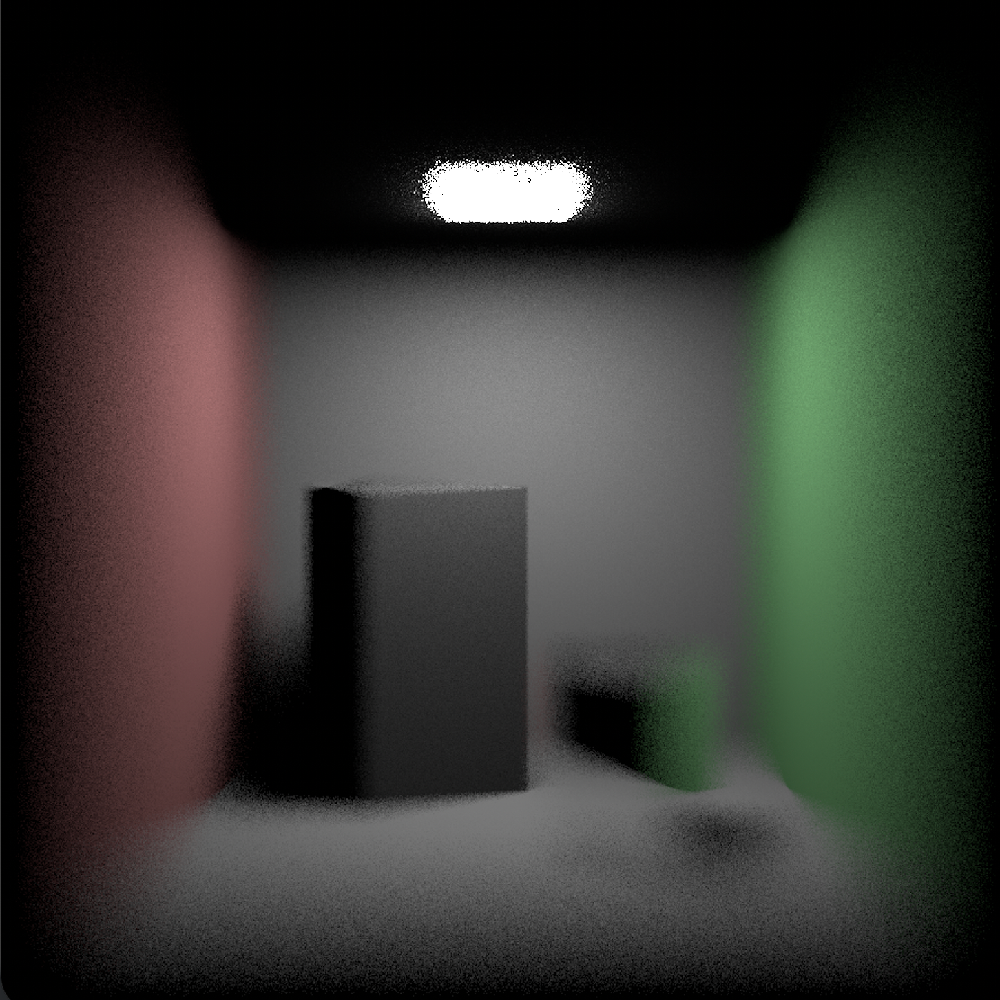

# Lab1 实验报告

张苏畅 231820107

代码实现在我 fork 的仓库中：https://github.com/Souvenal/Moer-lite

## 物体-光线求交

物体求交的逻辑在注释中写的都很清楚，代码实现基本是与注释步骤一一对应的。只要当交点到圆心的距离介于内径和外径之间时，就可以判断交点是在圆环内。

### 圆环-光线求交

```c++
bool Disk::rayIntersectShape(Ray &ray, int *primID, float *u, float *v) const {
    //* 1.光线变换到局部空间
    Ray localRay = transform.inverseRay(ray);
    
    //* 2.判断局部光线的方向在z轴分量是否为0
    if (std::abs(localRay.direction[2]) < EPSILON) {
        return false;
    }

    //* 3.计算光线和平面交点
    float t = (0.f - localRay.origin[2]) / localRay.direction[2];
    if (t < localRay.tNear || t > localRay.tFar) {
        return false;
    }
    Point3f hitPoint = localRay.at(t);
    assert(std::abs(hitPoint[2]) < EPSILON);

    //* 4.检验交点是否在圆环内
    float hitRadius = (hitPoint - Point3f(0.f)).length();
    if (hitRadius < innerRadius || radius < hitRadius) {
        return false;
    }
    float phi = std::atan2(hitPoint[1], hitPoint[0]);
    if (phi < 0) {
        phi += 2 * PI;
    }
    if (phi > phiMax) {
        return false;
    }

    //* 5.更新ray的tFar,减少光线和其他物体的相交计算次数
    ray.tFar = t;

    *u = phi / phiMax;
    *v = (hitRadius - innerRadius) / (radius - innerRadius);
    return true;
}
```



### 圆柱-光线求交

根据实验手册里的方程联立求解出 t 的两个取值，分别检验是否交点在圆柱上，优先看近处的交点，再看远处的交点。

```c++
bool Cylinder::rayIntersectShape(Ray &ray, int *primID, float *u, float *v) const {
    //* 1.光线变换到局部空间
    Ray localRay = transform.inverseRay(ray);

    //* 2.联立方程求解
    float dirX = localRay.direction[0], dirY = localRay.direction[1];
    float oriX = localRay.origin[0], oriY = localRay.origin[1];
    float A = dirX * dirX + dirY * dirY;
    float B = 2 * (oriX * dirX + oriY * dirY);
    float C = oriX * oriX + oriY * oriY - radius * radius;
    float t0 = 0, t1 = 0;
    if (!Quadratic(A, B, C, &t0, &t1)) {
        return false;
    }

    //* 3.检验交点是否在圆柱范围内
    float t;
    Point3f hitPoint;
    float phi;

    Point3f hitPoint0 = localRay.at(t0);
    float phi0 = std::atan2(hitPoint0[1], hitPoint0[0]);
    if (phi0 < 0) phi0 += 2 * PI;

    Point3f hitPoint1 = localRay.at(t1);
    float phi1 = std::atan2(hitPoint1[1], hitPoint1[0]);
    if (phi1 < 0) phi1 += 2 * PI;

    auto isValid = [&](const float t, const Point3f &hitPoint, float phi) {
        return
            t > localRay.tNear && t < localRay.tFar &&
            hitPoint[2] > 0 && hitPoint[2] < height &&
            phi < phiMax;
    };
    if (isValid(t0, hitPoint0, phi0)) {
        t = t0;
        hitPoint = hitPoint0;
        phi =  phi0;
    } else if (isValid(t1, hitPoint1, phi1)) {
        t = t1;
        hitPoint = hitPoint1;
        phi = phi1;
    } else {
        return false;
    }
    
    //* 4.更新ray的tFar,减少光线和其他物体的相交计算次数
    ray.tFar = t;

    *u = phi / phiMax;
    *v = hitPoint[2] / height;
    return true;
}
```



### 圆锥-光线求交

与圆柱的情况基本相同，区别只在联立的方程不同。

```c++
bool Cone::rayIntersectShape(Ray &ray, int *primID, float *u, float *v) const {
    //* todo 完成光线与圆柱的相交 填充primId,u,v.如果相交，更新光线的tFar

    //* 1.光线变换到局部空间
    Ray localRay = transform.inverseRay(ray);

    //* 2.联立方程求解
    Vector3f V(0.f, 0.f, -1.f);
    Vector3f D = localRay.direction;
    Vector3f CO = localRay.origin - Point3f(0.f, 0.f, height);
    float dot_D_V = dot(D, V);
    float dot_CO_V = dot(CO, V);
    float dot_D_CO =  dot(D, CO);
    float dot_CO_CO = dot(CO, CO);
    float A = dot_D_V * dot_D_V - cosTheta * cosTheta;
    float B = 2 * (dot_D_V * dot_CO_V - dot_D_CO * cosTheta * cosTheta);
    float C = dot_CO_V * dot_CO_V - dot_CO_CO * cosTheta * cosTheta;
    float t0, t1;
    if (!Quadratic(A, B, C, &t0, &t1)) {
        return false;
    }
    
    // ......
}
```



## 加速结构

### Octree

递归构建八叉树：

```c++
Octree::OctreeNode * Octree::recursiveBuild(const AABB &aabb,
                       const std::vector<int> &primIdxBuffer) {
  OctreeNode* node = new OctreeNode();
  node->boundingBox = aabb;
  node->primCount = primIdxBuffer.size();
  
  // 当前三角面数小于阈值时，不再继续细分
  if (primIdxBuffer.size() < ocLeafMaxSize) {
    std::copy(primIdxBuffer.begin(), primIdxBuffer.end(), node->primIdxBuffer);
    return node;
  }

  AABB subBoxes[8];
  std::vector<std::vector<int>> subBuffers(8);
  for (int i = 0; i < 8; ++i) {
    // 划分子节点 AABB
    Vector3f halfEdge = (aabb.pMax - aabb.pMin) / 2;
    Point3f pMin = aabb.pMin + Vector3f(((i & 1) != 0) * halfEdge[0], ((i & 2) != 0) * halfEdge[1], ((i * 4) != 0) * halfEdge[2]);
    Point3f pMax = pMin + halfEdge;
    subBoxes[i] = AABB(pMin, pMax);

    // 将三角面划分到子节点
    for (int index : primIdxBuffer) {
      if (shapes[index]->getAABB().Overlap(subBoxes[i])) {
        subBuffers[i].emplace_back(index);
      }
    }
  }

  for (int i = 0;  i < 8; ++i) {
    node->subNodes[i].reset(recursiveBuild(subBoxes[i], subBuffers[i]));
  }
  
  return node;
}
```

对于八叉树的求交，也需要进行递归遍历子节点：

```c++
subNodesIntersect = [&](OctreeNode* node, int* geomID, int *primID, float *u , float *v) -> bool {
    float tMin = std::numeric_limits<float>::min();
    float tMax = std::numeric_limits<float>::max();
    // 先于该节点的整体包围盒求交， 不相交则退出
    if (!node->boundingBox.RayIntersect(ray, &tMin, &tMax)) {
        return false;
    }

    if (node->primCount < ocLeafMaxSize) {
        // 子节点时，顺序与所有三角面相交
        for (int i = 0; i < node->primCount; ++i) {
        int index = node->primIdxBuffer[i];
        if (shapes[index]->rayIntersectShape(ray, primID, u, v)) {
            *geomID = shapes[index]->geometryID;
        }
        }
    } else {
        // 否则递归遍历
        for (int i = 0; i < 8; ++i) {
            subNodesIntersect(node->subNodes[i].get(), geomID, primID, u, v);
        }
    }

    return *geomID != -1;
};
```

### 三角面片-光线求交

这里还需要实现三角面片 `Triangle` 的求交逻辑和求交信息填充函数，对于求交我的处理比较简单：对于光线与平面的交点，判断其是否在三条边的同侧（看叉乘向量是否与法线同向），并列二元方程求解出 uv 坐标。

```c++
Point3f P = ray.at(t);
if (dot(cross(v1 - v0, P - v0), N) < 0.f ||
    dot(cross(v2 - v1, P - v1), N) < 0.f ||
    dot(cross(v0 - v2, P - v2), N) < 0.f) {

    return false;
}

float dot_e0_e1 = dot(e0, e1);
float dot_e0_e0 = dot(e0, e0);
float dot_e1_e1 = dot(e1, e1);
float dot_e0_v0P = dot(e0, P - v0);
float dot_e1_v0P = dot(e1, P - v0);
float delta = dot_e0_e0 * dot_e1_e1 - dot_e0_e1 * dot_e0_e1;
*u = (dot_e0_v0P * dot_e1_e1 - dot_e0_e1 * dot_e1_v0P) / delta;
*v = (dot_e0_e0 * dot_e1_v0P - dot_e0_e1 * dot_e0_v0P) / delta;
assert(0 <= *u && *u <= 1.f && 0 <= *v && *v <= 1.f && *u + *v <= 1.f);
```

更好的实现可以参照 Möller-Trumbore 算法，计算更加快捷。

### 结果对比





PS：这里加速比例感觉并不多，一方面是因为场景复杂度太小了，仅 900+ 个三角面，Octree 的层数不是很深，另一方面我加了 tbb 多线程，linear 也比较快。



## 薄透镜相机

### 圆盘均匀采样

根据 Inverse Method，希望在圆盘中均匀采样，则要满足笛卡尔坐标系下 $p(x, y)=\frac{1}{\pi}$，做极坐标变换后得到 $p(r, \theta)=r\cdot p(x, y)=\frac{r}{\pi}$。

分别对 $r$，$\theta$ 计算边缘概率分布，得到 $p(r)=2r$，$p(\theta)=\frac{1}{2\pi}$。

再由 PDF 计算 CDF，得到 $CDF(r)=r^2$，$CDF(\theta)=\frac{\theta}{2\pi}$。

再对 CDF 求逆，即可从遵循 $[0, 1]$ 分布的两个采样点 $u$，$v$ 得到 $r = \sqrt{u}$，$\theta = 2 \pi v$。

### 薄透镜相机代码

根据实验手册中的透镜相机示意图，由相似三角形求出 `pFoucus`，由 `pFoucus` 和圆盘上的随机采样点连线即可得到光线方向。

```c++
Ray ThinLensCamera::sampleRay(const CameraSample& sample, Vector2f NDC) const {
    float x = (NDC[0] - 0.5f) * film->size[0] + sample.xy[0],
        y = (0.5f - NDC[1]) * film->size[1] + sample.xy[1];

    float tanHalfFov = fm::tan(verticalFov * 0.5f);
    float z = -film->size[1] * 0.5f / tanHalfFov;
    
    float r = fm::sqrt(sample.lens[0]);
    float theta = 2 * PI * sample.lens[1];
    Point3f origin = transform.toWorld(Point3f(r * fm::cos(theta), r * fm::sin(theta), 0.f));
    
    float f = focalDistance / -z;
    Point3f pFoucus = transform.toWorld(Point3f(x * f, y * f, z * f));
    Vector3f direction = pFoucus - origin;
    direction = normalize(direction);
    
    return Ray(origin, direction, tNear, tFar, timeStart);
}
```

焦距 5.7：



焦距 6.5：


